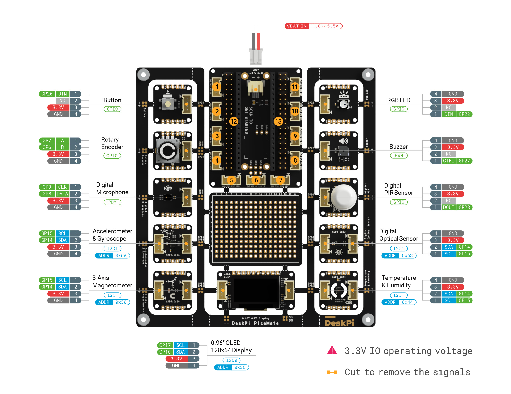

# Code for the DeskPi Picomate

[picomate user manual](https://deskpi.com/blogs/learn/deskpi-picomate-user-manual-and-sources)

## Python code is all derived from

* [picomate wiki](https://wiki.deskpi.com/picomate/)
* [picomate adafruit lib download](https://wiki.deskpi.com/picomate/#libraries-download) Use the most current except for ltr381rgb.py

## Pinout

